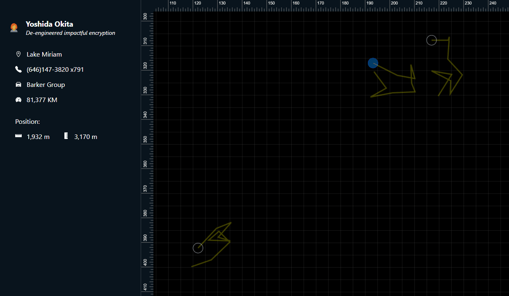

<div id="top"></div>
<!-- PROJECT LOGO -->
<br />
<div align="center">

<h3 align="center">Web Sockets Example</h3>

  <p align="center">
    A sample app for displaying Realtime data using web sockets (Node.js & React.js)
  </p>
</div>

<!-- TABLE OF CONTENTS -->
<details>
  <summary>Table of Contents</summary>
  <ol>
    <li>
      <a href="#about-the-project">About The Project</a>
      <ul>
        <li><a href="#built-with">Built With</a></li>
      </ul>
    </li>
        <li><a href="#installation">Installation</a></li>
  </ol>
</details>

<!-- ABOUT THE PROJECT -->

## About The Project

<!-- [![Screen Shot][product-screenshot]](./gif.gif) -->


A react app that fetches & displays realtime data from the node server which are changing frequently using websockets.
The data represent the co-ordinates of 20 randomly generated car drivers, as well as metadata for each driver (like name & location). Every small amount of time, one or more of the drivers' co-ordinates get randomly changed over a small scale. This change is also rendered in the front end in the image of a yellow line that displays the path history for each driver.

<p align="right">(<a href="#top">back to top</a>)</p>

### Built With

- [React.js](https://reactjs.org/)
- [Node.js](https://nodejs.org/en/)
- [Redux](https://redux.js.org/)

<p align="right">(<a href="#top">back to top</a>)</p>

<!-- GETTING STARTED -->

## Installation

Clone the repo

```sh
git clone https://github.com/Ahmed-ShawkyEgy/web-sockets-example.git
```

### Backend

1. Open a terminal at the `node-backend` folder

2. Install dependencies
   ```sh
   npm install
   ```
3. Run the app
   ```sh
    npm start
   ```

### Frontend

1. Open a terminal at the `react-frontend` folder

2. Install dependencies
   ```sh
   npm install
   ```
3. Run the app
   ```sh
    npm start
   ```

<p align="right">(<a href="#top">back to top</a>)</p>
